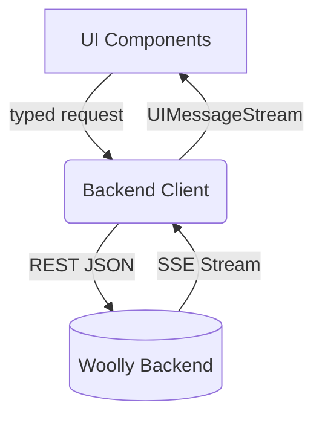
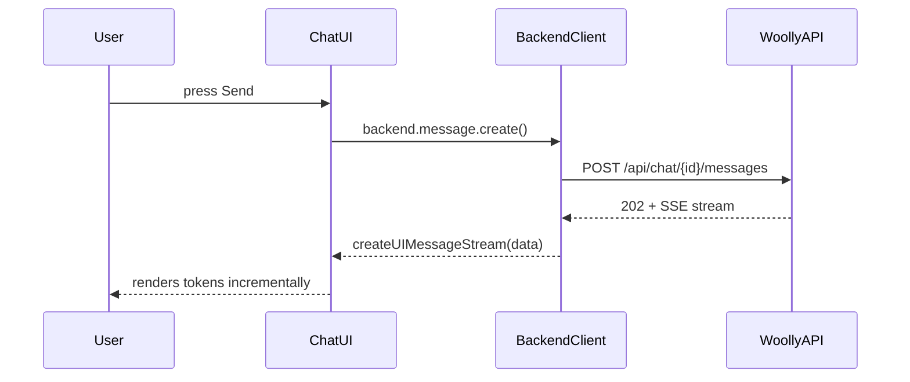

Ran tool

### 📄 Integration Plan & Roadmap

_(verbosity level 6 – concise yet thorough)_

---

#### 1. Executive Summary

We will migrate the chatbot from a local-DB-centric architecture to a thin-client model that consumes the Woolly backend exclusively. The work is divided into six linear stages that build on one another and gradually retire legacy database code while adding a typed API client, leaner UI flows, and higher-level AI-SDK UI helpers for smoother streaming and state management.

---

#### 2. Task Matrix

| #   | Goal                                                                                                                  | Key Files / Folders                                                                                                                      | Main Functions / Hooks                                                 | Complexity | DRY Opportunity                                                                 | Depends On |
| --- | --------------------------------------------------------------------------------------------------------------------- | ---------------------------------------------------------------------------------------------------------------------------------------- | ---------------------------------------------------------------------- | ---------- | ------------------------------------------------------------------------------- | ---------- |
| 1   | **Create Backend API client** (`lib/api/backend-client.ts`) exposing `chat`, `message`, `agent`, `health` namespaces. | NEW file, `lib/constants.ts`                                                                                                             | `request()`, `toCamel()`, `fromBackendError()`                         | ★★☆☆       | One generic fetch wrapper reused across namespaces.                             | –          |
| 2   | **Chat management migration** – create / list / delete / title-patch                                                  | `app/(chat)/api/chat/route.ts`, `app/(chat)/api/history/route.ts`, `components/sidebar-*`                                                | `SidebarHistory` SWR key, `handleDelete`, `prepareSendMessagesRequest` | ★★★☆       | Replace five separate fetches with `backend.chat.*` helpers.                    | 1          |
| 3   | **Message CRUD migration** – get / post / patch / delete                                                              | `components/chat.tsx`, `components/multimodal-input.tsx`, `components/artifact-messages.tsx`, `app/(chat)/api/chat/[id]/stream/route.ts` | `sendMessage`, `regenerate`, `stop`, `resumeStream`                    | ★★★★       | Move repeated fetch/transform logic into `backend.message.*` & a stream helper. | 2          |
| 4   | **UI Optimisation w/ AI-SDK** – use `createUIMessageStream`, `SWRConfig` batching, skeletons                          | `components/chat.tsx`, `components/data-stream-handler.tsx`, `components/sidebar-history.tsx`                                            | `useDataStream`, `useChatVisibility`, SWR `mutate` sequences           | ★★☆☆       | Extract common loading skeletons; centralise toast error handling.              | 3          |
| 5   | **Config & Env hardening**                                                                                            | `lib/constants.ts`, `.env.example`, `README.md`                                                                                          | `WOOLLY_BACKEND_URL` validation                                        | ★☆☆☆       | Single source of truth, auto-fallback for Vercel Preview vs Local.              | 4          |
| 6   | **Cleanup & Tests** – delete obsolete Drizzle queries; update Playwright routes                                       | `lib/db`, `tests/**`                                                                                                                     | `getChatById`, `saveMessages`, etc.                                    | ★★☆☆       | Remove ~500 LoC; convert tests to backend mocks.                                | 5          |

Legend ★☆☆☆ = low ★★★★ = high

---

#### 3. System Flows (Mermaid)

---

#### 4. Frontend Changes by Stage

1. **API Client**  
   • Add `request(method, path, body)` returning typed results  
   • Auto-camelCase conversion for JSON keys
2. **Chat Routes**  
   • Update history route to paginate via `GET /api/chats?limit=`  
   • Delete chat via `DELETE /api/chat/{id}` with toast feedback
3. **Message Handlers**  
   • Replace local `saveMessages` with `backend.message.create`  
   • Use `createUIMessageStream` directly in `chat.tsx` (already partially done)
4. **UI Enhancements**  
   • Replace manual loaders with `skeleton.tsx` components  
   • Batch SWR mutations after stream finish
5. **Configuration**  
   • `NEXT_PUBLIC_BACKEND_URL` required at build; fallback to `http://localhost:8000`
6. **Tests & Cleanup**  
   • Drop drizzle migrations; keep types only for local fallback  
   • Update Playwright mocks to hit Woolly mock server

---

#### 5. Backend Touch-points

No backend code changes are required for CRUD/streaming (all endpoints are ✅). Optional quality-of-life:

| Suggestion                                     | Area               | Benefit                    | Effort |
| ---------------------------------------------- | ------------------ | -------------------------- | ------ |
| Add CORS wildcard for `localhost:3000`         | FastAPI middleware | simplifies local dev       | low    |
| Expose `/api/chat/{id}?include_messages=false` | Chat list          | saves bandwidth on sidebar | medium |
| Provide `total` count header for pagination    | Chats & messages   | easier infinite-scroll     | low    |

---

#### 6. DRY Checklist

- Extract `fetcher` & error-to-toast once (Stage 1)
- Re-use message rendering list in `chat.tsx`, `artifact-messages.tsx`
- Centralise visibility toggle hook (`useChatVisibility`) to accept backend patch fn
- Move icon-only buttons to `components/ui/button-icon.tsx`

---

#### 7. Next Action

We begin with **Step 1 – Backend API Client Layer** to unblock every downstream task.  
Please confirm or suggest edits to the roadmap.
