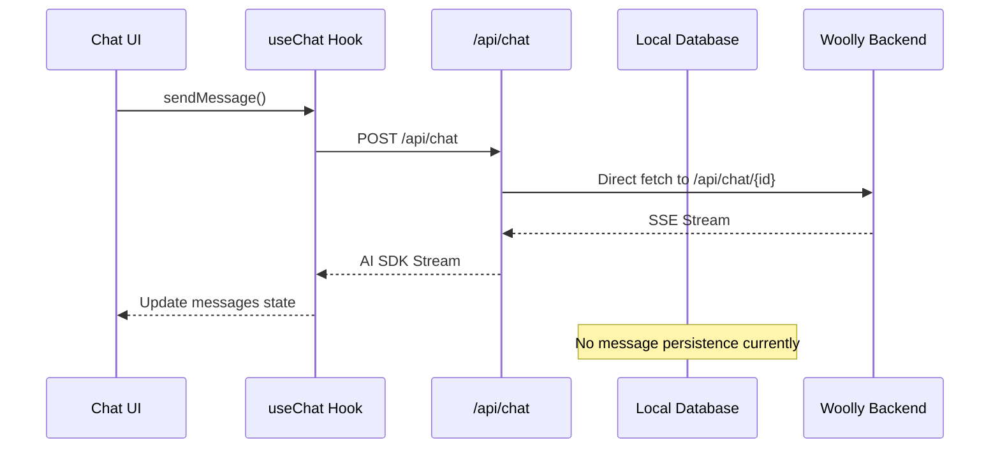
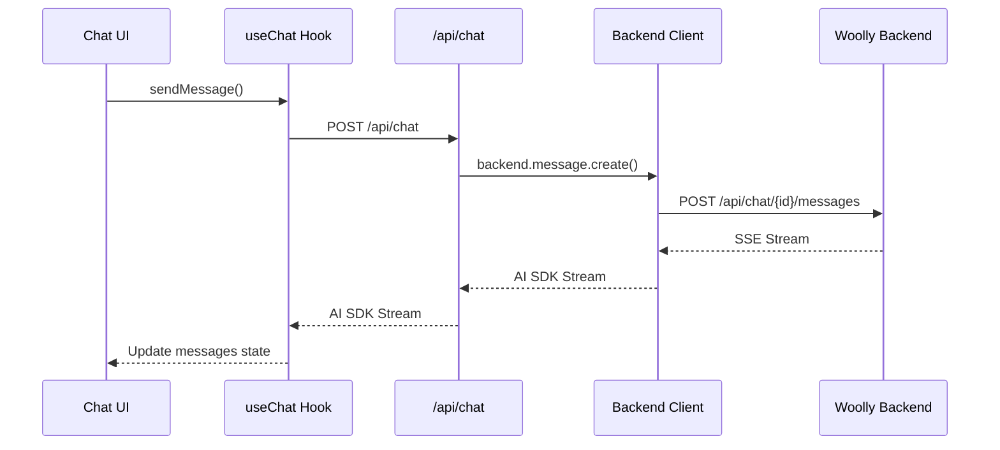

# Step 3: Message CRUD Migration - Survey Document

## 📋 **Executive Summary**

This document surveys all locations where message CRUD operations occur in the current codebase and identifies the specific changes needed to migrate from local database operations to the Woolly backend API.

**Current State**: Messages are managed through local Drizzle ORM queries and AI SDK's `useChat` hook  
**Target State**: All message operations use `backend.message.*` namespace from our API client  
**Complexity**: ★★★★ (High - involves streaming, state management, and UI coordination)

---

## 🎯 **Migration Targets**

### **1. Message Creation & Streaming**

**Priority**: 🔴 **Critical** - Core chat functionality

| **Current Implementation**             | **File**                             | **Function/Hook**            | **Migration Required**                                |
| -------------------------------------- | ------------------------------------ | ---------------------------- | ----------------------------------------------------- |
| AI SDK `useChat` with custom transport | `components/chat.tsx:61-95`          | `useChat<ChatMessage>`       | ✅ Update transport to use backend client             |
| Streaming proxy to Woolly backend      | `app/(chat)/api/chat/route.ts:8-196` | `POST` handler               | ✅ Replace direct fetch with `backend.message.create` |
| Message preparation for sending        | `components/chat.tsx:69-79`          | `prepareSendMessagesRequest` | ✅ Update to backend format                           |

### **2. Message Retrieval & Display**

**Priority**: 🟡 **Medium** - Currently using initialMessages prop

| **Current Implementation**   | **File**                                 | **Function/Hook**      | **Migration Required**                |
| ---------------------------- | ---------------------------------------- | ---------------------- | ------------------------------------- |
| Initial messages from server | `app/(chat)/chat/[id]/page.tsx:17-59`    | Server component       | ✅ Use `backend.message.list(chatId)` |
| Local database query         | `lib/db/queries.ts:223-236`              | `getMessagesByChatId`  | ❌ Delete after migration             |
| Message display components   | `components/messages.tsx:23-95`          | `PureMessages`         | ✅ Minor - ensure compatibility       |
| Artifact message display     | `components/artifact-messages.tsx:22-97` | `PureArtifactMessages` | ✅ Minor - ensure compatibility       |

### **3. Message Editing**

**Priority**: 🟡 **Medium** - Used in message editor

| **Current Implementation** | **File**                               | **Function/Hook**                      | **Migration Required**                                |
| -------------------------- | -------------------------------------- | -------------------------------------- | ----------------------------------------------------- |
| Message editor component   | `components/message-editor.tsx:24-111` | `MessageEditor`                        | ✅ Replace `deleteTrailingMessages` with backend call |
| Trailing message deletion  | `app/(chat)/actions.ts:22-25`          | `deleteTrailingMessages`               | ✅ Implement with `backend.message.update`            |
| Local database deletion    | `lib/db/queries.ts:417-453`            | `deleteMessagesByChatIdAfterTimestamp` | ❌ Delete after migration                             |

### **4. Message Deletion**

**Priority**: 🟢 **Low** - Not currently exposed in UI

| **Current Implementation** | **File**                            | **Function/Hook** | **Migration Required**                              |
| -------------------------- | ----------------------------------- | ----------------- | --------------------------------------------------- |
| Backend client ready       | `lib/api/backend-client.ts:282-284` | `message.delete`  | ✅ Already implemented                              |
| No UI implementation       | N/A                                 | N/A               | 🔄 Consider adding delete button to message actions |

### **5. Stream Resumption**

**Priority**: 🟡 **Medium** - Auto-resume functionality

| **Current Implementation** | **File**                                          | **Function/Hook** | **Migration Required**               |
| -------------------------- | ------------------------------------------------- | ----------------- | ------------------------------------ |
| Stream resumption route    | `app/(chat)/api/chat/[id]/stream/route.ts:15-115` | `GET` handler     | ✅ Update to use backend client      |
| Auto-resume hook           | `hooks/use-auto-resume.ts:15-47`                  | `useAutoResume`   | ✅ Ensure compatibility with backend |

---

## 🔄 **Data Flow Analysis**

### **Current Message Flow**

### **Target Message Flow**

---

## 📁 **File-by-File Migration Plan**

### **Phase 1: Core Streaming (Critical Path)**

#### **1.1 Update Chat API Route**

**File**: `app/(chat)/api/chat/route.ts`

- **Current**: Direct fetch to Woolly backend
- **Target**: Use `backend.message.create()` with streaming support
- **Complexity**: ★★★☆ - Need to maintain AI SDK compatibility

#### **1.2 Update Chat Component Transport**

**File**: `components/chat.tsx`

- **Current**: Custom transport with `prepareSendMessagesRequest`
- **Target**: Update message format for backend client
- **Complexity**: ★★☆☆ - Mainly data transformation

### **Phase 2: Message Retrieval**

#### **2.1 Update Chat Page Server Component**

**File**: `app/(chat)/chat/[id]/page.tsx`

- **Current**: Uses `getMessagesByChatId` from local DB
- **Target**: Use `backend.message.list(chatId)`
- **Complexity**: ★★☆☆ - Straightforward API swap

#### **2.2 Ensure Component Compatibility**

**Files**: `components/messages.tsx`, `components/artifact-messages.tsx`

- **Current**: Expects `ChatMessage[]` format
- **Target**: Ensure backend messages transform correctly
- **Complexity**: ★☆☆☆ - Likely no changes needed

### **Phase 3: Message Editing**

#### **3.1 Update Message Editor**

**File**: `components/message-editor.tsx`

- **Current**: Uses `deleteTrailingMessages` action
- **Target**: Use `backend.message.update()` directly
- **Complexity**: ★★★☆ - Need to handle edit + regenerate flow

#### **3.2 Update Server Actions**

**File**: `app/(chat)/actions.ts`

- **Current**: Placeholder `deleteTrailingMessages`
- **Target**: Implement with backend client
- **Complexity**: ★★☆☆ - Server action with backend call

### **Phase 4: Stream Resumption**

#### **4.1 Update Stream Route**

**File**: `app/(chat)/api/chat/[id]/stream/route.ts`

- **Current**: Has TODO comments for missing functionality
- **Target**: Implement with backend client
- **Complexity**: ★★★☆ - Need to understand resumption requirements

---

## 🔧 **Technical Considerations**

### **Data Transformation Requirements**

| **Frontend Format**           | **Backend Format**                | **Transformation Needed**        |
| ----------------------------- | --------------------------------- | -------------------------------- |
| `ChatMessage.parts[].text`    | `BackendMessage.content`          | ✅ Extract text from parts array |
| `ChatMessage.id`              | `BackendMessage.id`               | ✅ Direct mapping                |
| `ChatMessage.role`            | `BackendMessage.role`             | ✅ Direct mapping                |
| `ChatMessage.toolInvocations` | `BackendMessage.tool_invocations` | ✅ camelCase ↔ snake_case        |

### **Streaming Compatibility**

- **Current**: AI SDK V5 `createUIMessageStream`
- **Target**: Maintain same interface, update data source
- **Challenge**: Ensure backend streaming format works with AI SDK

### **State Management**

- **Current**: `useChat` manages local state + SWR for history
- **Target**: Same pattern, but backend-sourced data
- **Challenge**: Coordinate optimistic updates with backend state

### **Error Handling**

- **Current**: `ChatSDKError` for UI feedback
- **Target**: Backend client errors → `ChatSDKError`
- **Challenge**: Maintain consistent error UX

---

## 🧪 **Testing Strategy**

### **Critical Test Scenarios**

1. **Send Message**: New message creation and streaming
2. **Edit Message**: Message editing with regeneration
3. **Stream Resumption**: Auto-resume interrupted streams
4. **Error Handling**: Network failures, backend errors
5. **State Synchronization**: UI state vs backend state consistency

### **Rollback Plan**

- Keep current implementation alongside new one
- Feature flag to switch between local DB and backend
- Gradual migration with fallback capability

---

## 📊 **Impact Assessment**

### **High Impact Changes** 🔴

- `app/(chat)/api/chat/route.ts` - Core streaming functionality
- `components/chat.tsx` - Main chat interface
- `app/(chat)/chat/[id]/page.tsx` - Message loading

### **Medium Impact Changes** 🟡

- `components/message-editor.tsx` - Message editing
- `app/(chat)/actions.ts` - Server actions
- `app/(chat)/api/chat/[id]/stream/route.ts` - Stream resumption

### **Low Impact Changes** 🟢

- `components/messages.tsx` - Display components (likely no changes)
- `components/artifact-messages.tsx` - Display components (likely no changes)

---

## ✅ **Success Criteria**

1. **✅ All message operations use backend client**
2. **✅ Streaming functionality maintained**
3. **✅ Message editing works with backend**
4. **✅ No console errors or failed API calls**
5. **✅ Performance equivalent or better**
6. **✅ All existing tests pass**

---

## 🚀 **Next Steps**

1. **Start with Phase 1** - Core streaming migration
2. **Test thoroughly** after each phase
3. **Update backend client** if needed for streaming
4. **Coordinate with backend team** for any API adjustments
5. **Document new patterns** for future development

---

**Status**: 📋 **Survey Complete** - Ready to begin Phase 1 implementation
