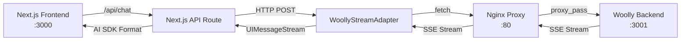

# Streaming Issue Analysis & Solution Plan

## TL;DR

**Problem**: Streaming doesn't work when the Woolly backend is behind an nginx proxy. The response is buffered and sent all at once instead of streaming.

**Root Cause**: Missing HTTP headers that tell nginx not to buffer the response.

**Backend Format**: ✅ Confirmed correct - sends proper AI SDK v5 data stream format:

```
0:{"type": "text", "text": "Hello"}
e:{"finishReason":"stop","usage":{...}}
```

**Solution**: Add two headers to the existing implementation in `app/(chat)/api/chat/route.ts`:

```typescript
headers: {
  'Content-Encoding': 'none',                    // ✓ Already present
  'Cache-Control': 'no-cache, no-transform',     // ← Add this
  'X-Accel-Buffering': 'no',                    // ← Add this (critical for nginx)
}
```

**Effort**: 5 minutes to implement, 30 minutes to test.

---

## 1. Current Architecture Overview

### System Components



### Docker Setup

- **woolly-nginx-1**: Reverse proxy on port 80
- **woolly-backend-1**: FastAPI backend on port 3001 (internal)
- **woolly-frontend-1**: Separate frontend on port 3000 (internal)

## 2. Issue Identification

### Primary Symptoms

1. Streaming doesn't work when proxied through nginx
2. Instead of real-time streaming, the full response is returned after completion
3. The AI SDK documentation explicitly mentions this proxy issue

### Root Causes

#### A. Nginx Buffering

Nginx by default buffers responses before sending them to clients. For SSE/streaming:

- `proxy_buffering on` (default) causes nginx to buffer the entire response
- `proxy_cache` might be caching responses
- `gzip` compression interferes with streaming

#### B. Missing Headers

Based on AI SDK documentation, the following headers are critical:

```javascript
'Content-Encoding': 'none'  // Prevents compression
'Cache-Control': 'no-cache, no-transform'  // Prevents caching
'X-Accel-Buffering': 'no'  // Nginx-specific: disables buffering
```

#### C. Stream Format Mismatch

The current implementation has several issues:

1. **Manual Parsing**: WoollyStreamAdapter manually parses AI SDK protocol
2. **Missing Events**: Not all AI SDK v5 events are properly handled
3. **Incorrect Headers**: The response might not have proper SSE headers

## 3. Current Implementation Analysis

### Frontend Flow

```typescript
// components/chat.tsx
useChat({
  transport: new DefaultChatTransport({
    api: "/api/chat", // Local Next.js API route
    fetch: fetchWithErrorHandlers,
  }),
});
```

### API Route (app/(chat)/api/chat/route.ts)

```typescript
const stream = await WoollyStreamAdapter.createMessageStream(chatId, message, {
  messageId,
});
return createUIMessageStreamResponse({
  stream,
  headers: {
    "Content-Encoding": "none", // ✓ Good - header is set
  },
});
```

### WoollyStreamAdapter Issues

1. **Manual Protocol Parsing**: Reimplements AI SDK protocol parsing
2. **No Proxy Headers**: Doesn't add nginx-specific headers to backend request
3. **Error Propagation**: Errors might not properly propagate through stream

## 4. Solution Options

### Option 1: Fix Headers in Current Implementation (Recommended) ⭐

**Approach**: Add missing proxy headers to the existing implementation

```typescript
// Update app/(chat)/api/chat/route.ts
export async function POST(request: Request) {
  try {
    const body = await request.json();
    const { id, message } = body;
    const chatId = id || crypto.randomUUID();

    // Generate a proper message ID for the assistant response
    const messageId = generateId();

    // Use the WoollyStreamAdapter to create a properly formatted AI SDK stream
    const stream = await WoollyStreamAdapter.createMessageStream(
      chatId,
      message,
      { messageId }
    );

    return createUIMessageStreamResponse({
      stream,
      headers: {
        "Content-Encoding": "none", // ✓ Already present
        "Cache-Control": "no-cache, no-transform", // Add this
        "X-Accel-Buffering": "no", // Critical for nginx proxy
      },
    });
  } catch (error) {
    return ErrorHandler.toResponse(error);
  }
}
```

**Pros:**

- Minimal change to existing code
- Maintains current architecture
- Proven solution for proxy issues
- Low risk

**Cons:**

- None - this is the standard solution for proxy streaming issues

### Option 2: Fix Current Adapter

**Approach**: Enhance WoollyStreamAdapter with missing features

```typescript
class WoollyStreamAdapter {
  static async createMessageStream(...) {
    const response = await fetch(`${getWoollyBackendUrl()}/api/chat/${chatId}`, {
      headers: {
        'Content-Type': 'application/json',
        'Accept': 'text/event-stream',
        // These might help with proxy issues
        'Cache-Control': 'no-cache',
      },
    });

    // Check if response is actually streaming
    const contentType = response.headers.get('content-type');
    if (!contentType?.includes('text/event-stream')) {
      console.warn('Backend did not return SSE stream');
    }

    // ... rest of implementation
  }
}
```

**Pros:**

- Maintains current architecture
- More control over parsing

**Cons:**

- Duplicates AI SDK functionality
- More error-prone
- Harder to maintain

### Option 3: Backend Stream Passthrough

**Approach**: Make Next.js API route a transparent proxy

```typescript
export async function POST(request: Request) {
  const body = await request.json();

  const backendResponse = await fetch(`${BACKEND_URL}/api/chat/${body.id}`, {
    method: "POST",
    headers: {
      "Content-Type": "application/json",
      Accept: "text/event-stream",
    },
    body: JSON.stringify(transformRequestForBackend(body)),
  });

  // Pass through the stream with proxy headers
  return new Response(backendResponse.body, {
    headers: {
      "Content-Type": "text/event-stream",
      "Content-Encoding": "none",
      "Cache-Control": "no-cache, no-transform",
      "X-Accel-Buffering": "no",
      Connection: "keep-alive",
    },
  });
}
```

**Pros:**

- Simplest implementation
- No stream parsing needed
- Backend controls format

**Cons:**

- Less flexibility for frontend transformations
- Requires backend to be 100% AI SDK compatible

## 5. Testing Strategy

### Local Testing

```bash
# Test direct backend streaming (bypass proxy)
curl -N -X POST http://localhost:3001/api/chat/test-id \
  -H "Content-Type: application/json" \
  -d '{"messages": [{"role": "user", "content": "test"}]}'

# Test through nginx proxy
curl -N -X POST http://localhost/api/chat/test-id \
  -H "Content-Type: application/json" \
  -d '{"messages": [{"role": "user", "content": "test"}]}'

# Test through Next.js
curl -N -X POST http://localhost:3000/api/chat \
  -H "Content-Type: application/json" \
  -d '{"id": "test-id", "message": {"role": "user", "content": "test"}}'
```

### Debug Headers

Add logging to verify headers:

```typescript
console.log(
  "Response headers:",
  Object.fromEntries(response.headers.entries())
);
```

## 6. Recommended Implementation Plan

### Phase 1: Quick Fix (1 hour)

1. Add nginx-specific headers to current implementation
2. Verify backend is sending proper SSE format
3. Add debug logging for stream events

### Phase 2: Proper Solution (30 minutes)

1. Implement Option 1 (Add missing headers)
2. Test streaming with curl to verify headers
3. Test in browser with proxy
4. Monitor network tab for proper SSE events

### Phase 3: Backend Verification (1 hour)

1. Ensure backend sends proper AI SDK v5 format
2. Verify nginx configuration has SSE support
3. Add monitoring for streaming performance

## 7. Code Changes Required

### 1. Update API Route (app/(chat)/api/chat/route.ts)

```typescript
export async function POST(request: Request) {
  try {
    const body = await request.json();
    const { id, message } = body;
    const chatId = id || crypto.randomUUID();

    // Generate a proper message ID for the assistant response
    const messageId = generateId();

    // Use the WoollyStreamAdapter to create a properly formatted AI SDK stream
    const stream = await WoollyStreamAdapter.createMessageStream(
      chatId,
      message,
      { messageId }
    );

    return createUIMessageStreamResponse({
      stream,
      headers: {
        "Content-Encoding": "none", // Prevent compression
        "Cache-Control": "no-cache, no-transform", // Prevent caching
        "X-Accel-Buffering": "no", // Critical for nginx proxy
      },
    });
  } catch (error) {
    return ErrorHandler.toResponse(error);
  }
}
```

### 2. No Changes to WoollyStreamAdapter

The existing WoollyStreamAdapter implementation is correct and doesn't need changes. It properly:

- Parses the AI SDK v5 data stream format from the backend
- Transforms it into UIMessageStream events
- Handles all the necessary event types (text-start, text-delta, text-end, finish)

The streaming issue is purely a proxy configuration issue, not a parsing issue.

### 3. Add Environment Variable Validation

```typescript
// lib/constants.ts
export function getWoollyBackendUrl(): string {
  const url = process.env.NEXT_PUBLIC_BACKEND_URL || "http://localhost";

  // In production, ensure we're using the proxied URL
  if (process.env.NODE_ENV === "production" && url.includes("localhost")) {
    console.warn("Using localhost backend URL in production!");
  }

  return url;
}
```

## 8. Nginx Configuration (If Accessible)

If you have access to nginx configuration, ensure these settings:

```nginx
location /api/ {
    proxy_pass http://backend:3001;

    # SSE specific settings
    proxy_buffering off;
    proxy_cache off;
    proxy_set_header Connection '';
    proxy_http_version 1.1;
    chunked_transfer_encoding off;

    # Headers for SSE
    proxy_set_header Accept-Encoding "";
    proxy_set_header Cache-Control "no-cache";

    # Timeouts for long-running streams
    proxy_read_timeout 86400;
    send_timeout 86400;
}
```

## 9. Summary

The streaming issue is caused by:

1. **Nginx proxy buffering** the response
2. **Missing headers** that disable buffering/compression
3. The current implementation only has `Content-Encoding: none` but is missing other critical headers

The solution is to:

1. Add `Cache-Control: no-cache, no-transform` header
2. Add `X-Accel-Buffering: no` header (Critical for nginx)
3. Keep the existing `Content-Encoding: none` header

This is indeed a small change as you suspected - just adding two more headers to the existing response. The WoollyStreamAdapter and the rest of the implementation are correct and don't need changes.
